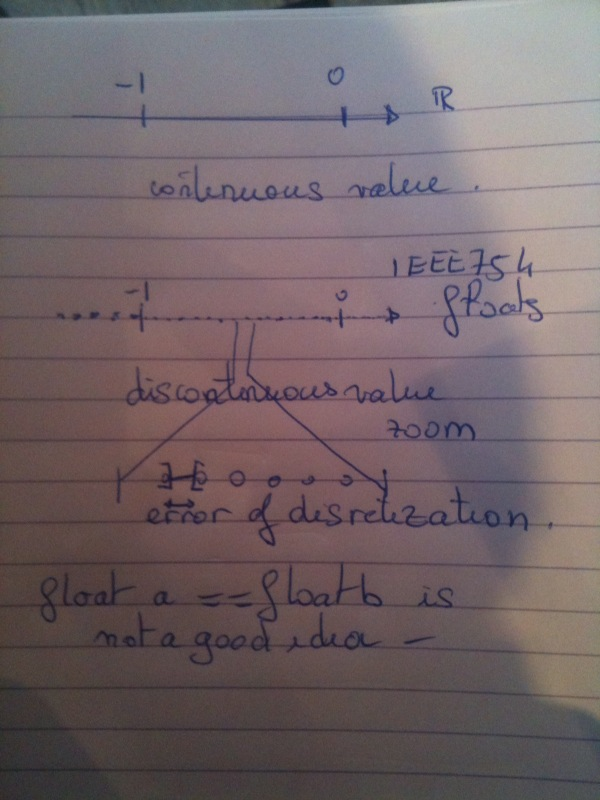

======================
Are they natural APIs?
======================

Float and exact matching
========================

Well our intuition of number is the one from math. Computer numbers are not the
same. I know this is a trivia, but I see all the time developers ignoring this:

Since computer IEEE754 is only exact an precise for sums of power of 1/2, thus
exact matching is made this way::
    >>> good_enough=10e-5
    >>> wanted = 0.01
    >>> .1 * .1
    >>> 0.010000000000000002
    >>> abs( ( .1*.1 ) - wanted ) < good_enough
    True

Okay nice. This is our first example. 

Complex or the class 2D Point
=============================

So, in stdlib documentation for `named tuple`_ we propose writing a useless class: the 2D point.

.. _named tuple: http://docs.python.org/library/collections.html#namedtuple-factory-function-for-tuples-with-named-fields

While in python we a base type that having all the needed feature: the complex 
type. 

Given you call *x* the *real part*, and *y* the *imaginary part*, then you have
a 2D point. 

Let's restate the obvious::
    >>> a=complex(1,2)

This is both a point declaration and a vector whose origin is complex(0,0).

Now, let's shrink the vector by an homothetia a 100 scale::
    >>> a=.1*(.1*a)
    >>> a
    (0.010000000000000002+0.020000000000000004j)
    >>> wanted=.01+.02j
    >>> tolerable_margin=10e-5
    >>> abs(wanted-a)<tolerable_margin
    True
**It works!**

By the way, what is **abs**? 

Norm of a vector
****************

What does abs in python?::

    Return the absolute value of a number. The argument may be a plain or long integer or a floating point number. If the argument is a complex number, its magnitude is returned.

Well it is basically the distance from the origin 0. 

So basically the preivous python code is

**is the distance between a and wanted comprised in a 10e-5 radius.**

And what does a - wanted means?
*******************************

So with the datetime example we now understand minus (__sub__) is in fact
an **addition** of the **reversed** value of *wanted*  to *a*.

*wanted* and *a* are de facto vectors. Thus, **addition is put simply a 
translation**.

What is a multiplication? 
*************************

A multiplication is an homothetia from a vector.

Summarizing up
==============

For the following types:

- complex;
- floats;
- datetime we have a natural API. 

That is based on:

- by combining two vectors, we always a vector;
- interval are vectors; 
- abs transforms a vector into a scalar called norm or distance. 

Thus ::
    >>> abs( a-b ) < margin
    ## is the same as
    >>> a == b ± margin

And since computer makes mistakes in some cases (by rounding) it is therefore
the closest answer we have to the mathematical truth called equality. 

Next question is does it works for everything?

