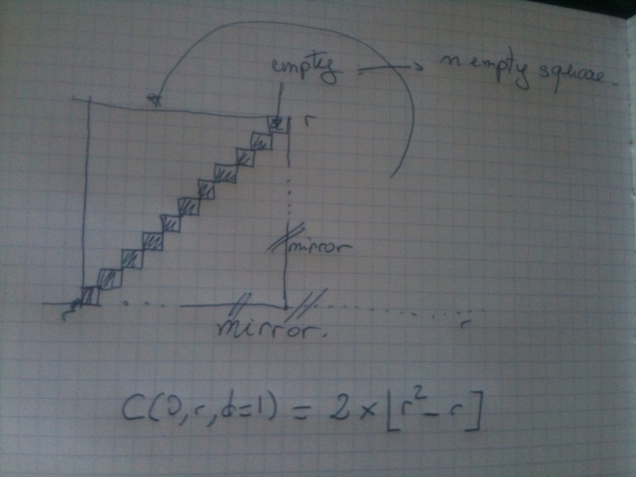
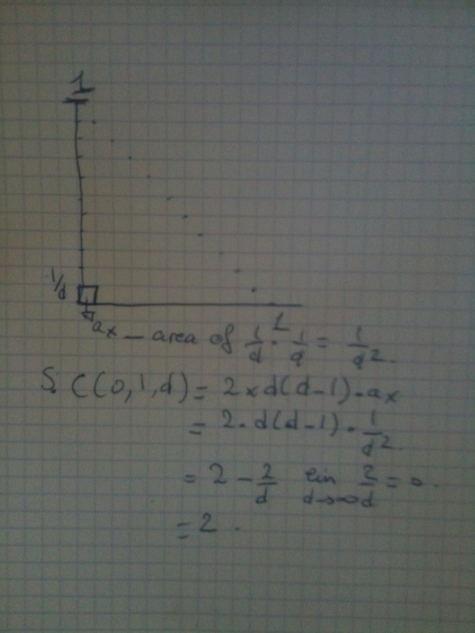

=================================================
Some interesting properties of Manhattan geometry
=================================================

Manhattan geometry, which is a discrete geometry whose axioms are: 

- the universe is discretized in quantum of distance;
- 2 points A & B defines more than one segments;
- a circle is twitesd square, but a square is still a square;
- something about the sum of the angle in a triangle;
- there is an infinite number of rights coming through a point, but it is an infinity less than in euclidean geometry; 
- parallels may share an infinity of subsegment that are periodics; 
- the generalized distance is L1 for whatever dimension you use; 

.. note:: Given:
   
   - dimension varying from 0 to i;
   - X,Y denoting of coordinate Union(| xi >) Union(| yi >)
   
   Then distance is :
   *D(x,y)=Sum(0,i)(abs(yi-xi))*

For the following let us denote C(O,r,x) a circle C of center O(irigin) with
a radius r, with a level of discretization x. Default being 1. 

The level of discretization indicates how many division I accept in the unit vector. 

Circonference of a circle
=========================

.. note:: Circonference(C(O,r,d)=8 x r

Whatever the discretization level is Circonference will always be the same \o/

Area of circle
==============

This one is quite funnier, so let'es draw some pictures :) 

The area is measured by the number of square contained within the envelope
of a Circle C(O,r,d) such as any edge is a vertex which length is inferior 
or equal to r measured by L1 from O.

Which strangealy enough tells us that the area of C(0,1,1) is 0

Now let's study the case where the discretization level is not 1  for unit Circle: 
C(O,1,d=x).

.. note:: The surface of the unit circle will tend towards 2.
   **A(0,1,d)=2(1-1/d)**

It is trivial to demonstrate that 
**A(0,r,d=D)=r.(A(0,1d=D)**
thus

.. note:: A(0,r,d)=r.2.(1-1/d) 

    **A(0,r,d=>inf)=2xr**

Nth dimensional probem of the volume
====================================

This one is boring easy so let's just state the results: 

.. note:: given n dimension, the volume V of dimemsion n is
   
   **Vn(0,r,d=>inf)=2^(n-1) . r**

   Plus if the Area of dimension n is denoted A

   *An(0,r,d) > Vn(0nr,d) whatever the dimension is*

So in three dimensions for instance, the surface of the sphere will have
a measure in measure^n inferior to its surface in measure^(n-1), thus the ratio
V/A < 1. In a Manhattan driven geometry big mammals would not exists, since 
the reason to be of large mass is diminishing this ratio so that you radiate  less heat. 

Since computers are Manhattan driven geometry, thus some problem might give 
false results. 

Conclusion
==========

Geometry are abstract yet intuitive constructions. What may looks like an
intellectual wanking is interesting: Manhattan geometry is a geometry fitted
for problems where distance between to points can be expressed as quantum
of differences. Plus since it is pretty intuitive, it is easier to handle 
than nth dimension generalized euclidian geometry. 

Plus since is does not rely on real numbers but on on natural integers, 
measures are peculiarly well suited for computers. Since we have order relations
it permits what we love to do with computers: 

- comparing;
- sorting.

